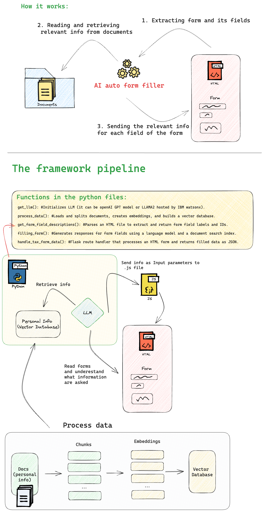

# FormGenie

Welcome to the Automated AI Form Filler project! This guided project will walk you through the process of creating an AI agent that streamlines the task of completing online forms. By integrating AI models with web technologies, you can automate the form-filling process based on provided data.

## Project Overview

In essence, this project eliminates the manual effort of entering information into online forms by leveraging the content from your documents, ultimately saving you time and effort.
